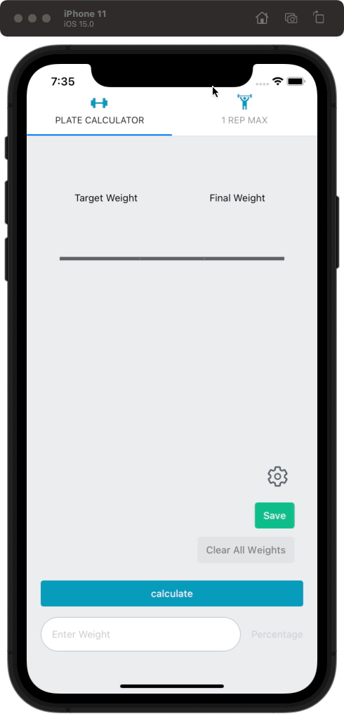

    

# Plate Calculator

---

## Warning:

This application is no longer being supported. I haven't had much time to keep it up to date and will be replacing this with an easier to maintain PWA version soon.

---

This is a simple application made with React Native that calculates what plates you should place on the barbell given a certain weight in lbs.

Live version is still in development. If you have the [Expo Go](https://expo.dev/client) app on your phone you can run the current version of the app through this link. https://expo.dev/@alexmnet/platecalculator

My first version of this app can be found here https://github.com/AlexMNet/weight-calculator and is a web app version only using JS and CSS

Since I actually used the previous version for every workout, which is deployed with github-pages, I decided to make a mobile version since I use it on my phone.

I thought this would be a fun simple project that would help me learn React-Native and also just continue to learn react in general.

If you have any questions or suggestions feel free to reach out to me. Thank you!
